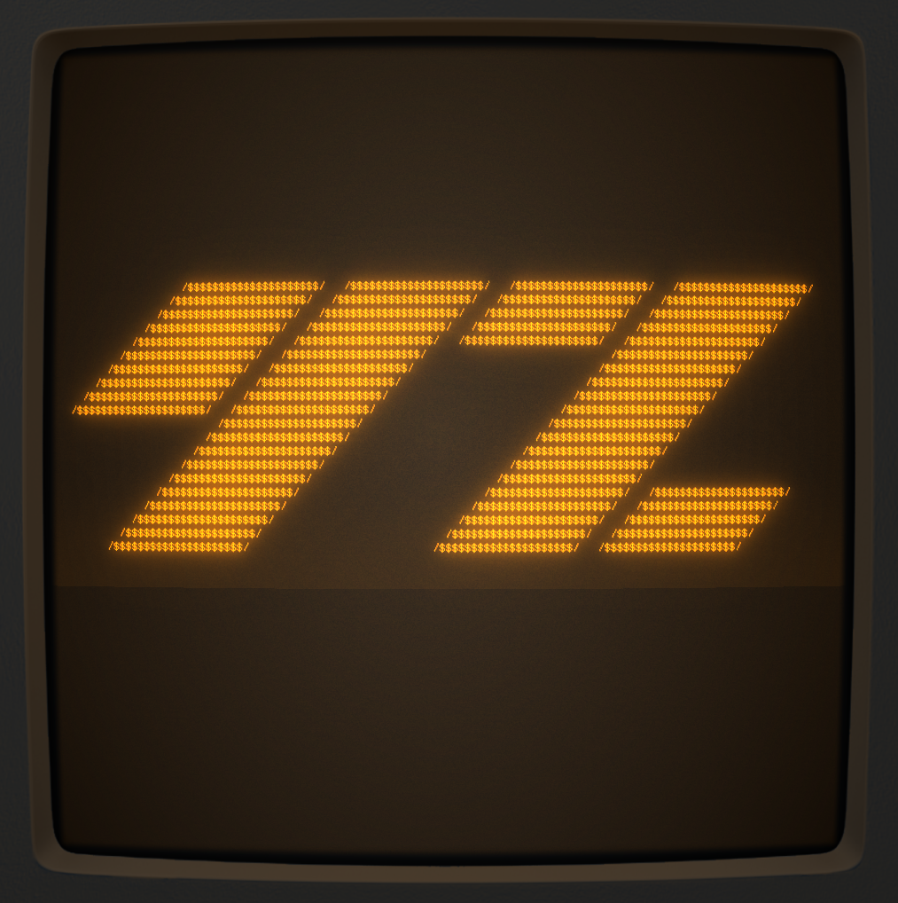
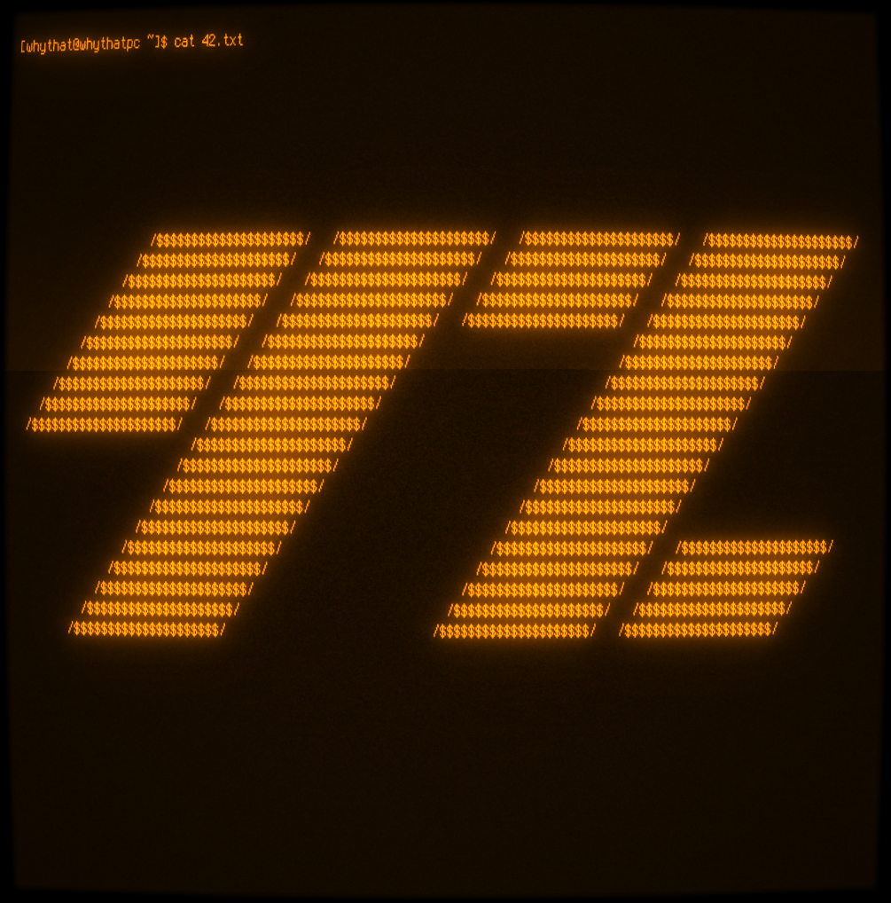
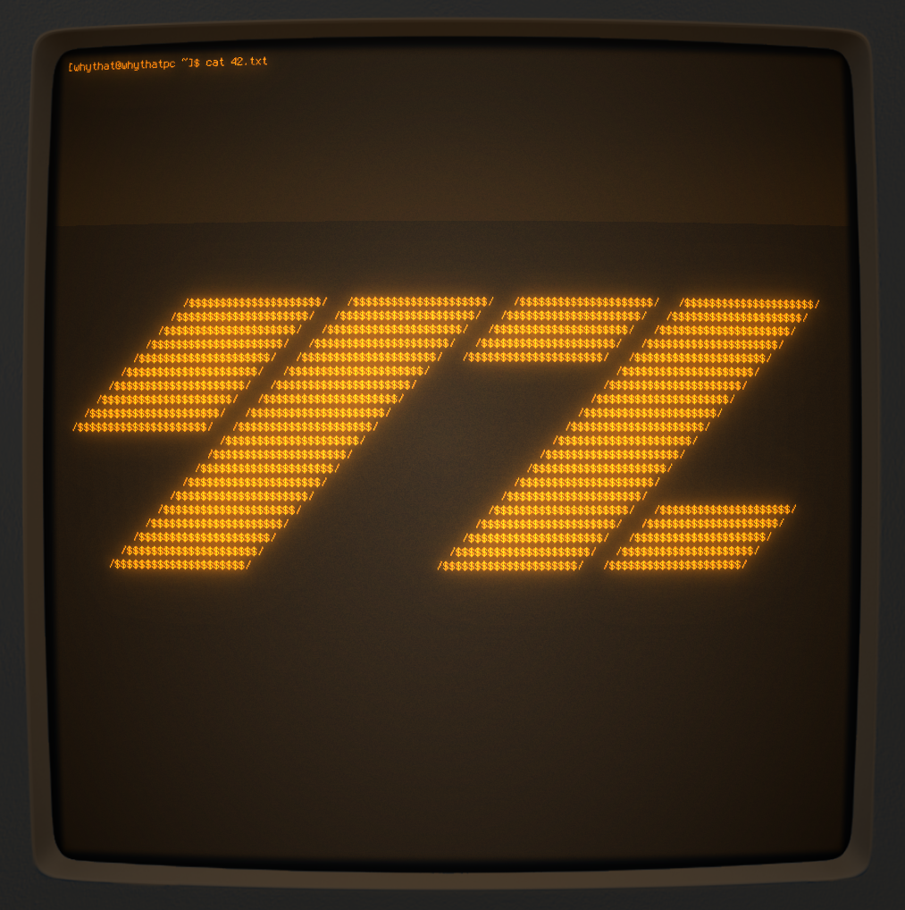
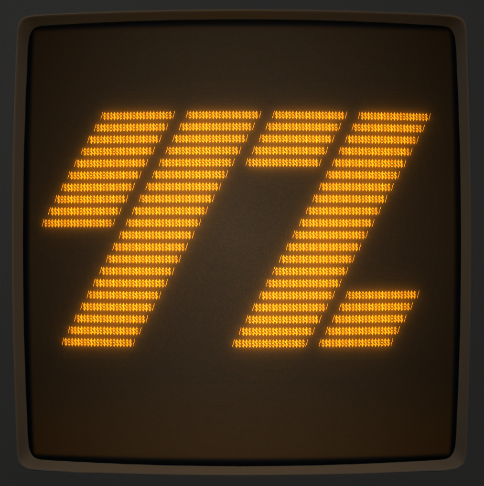
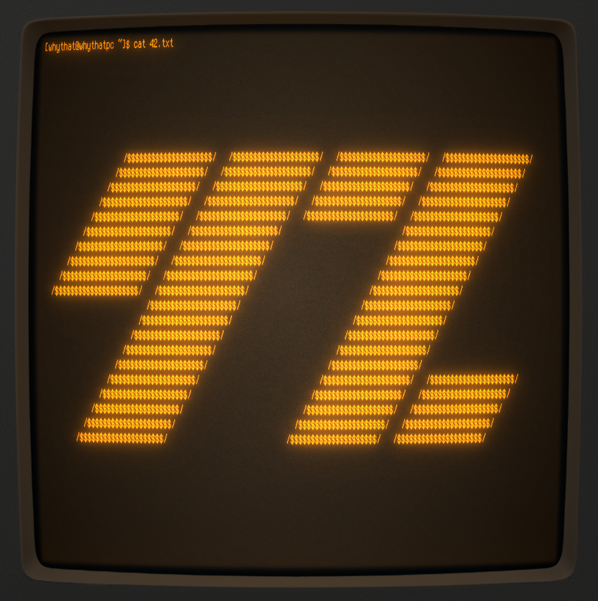
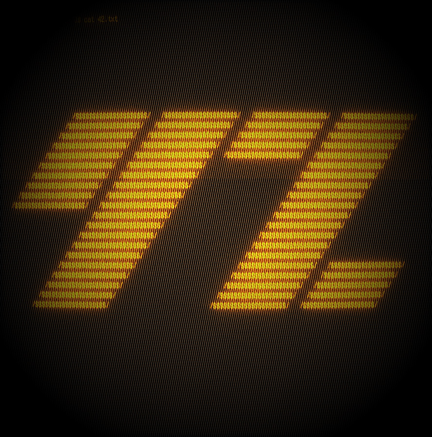
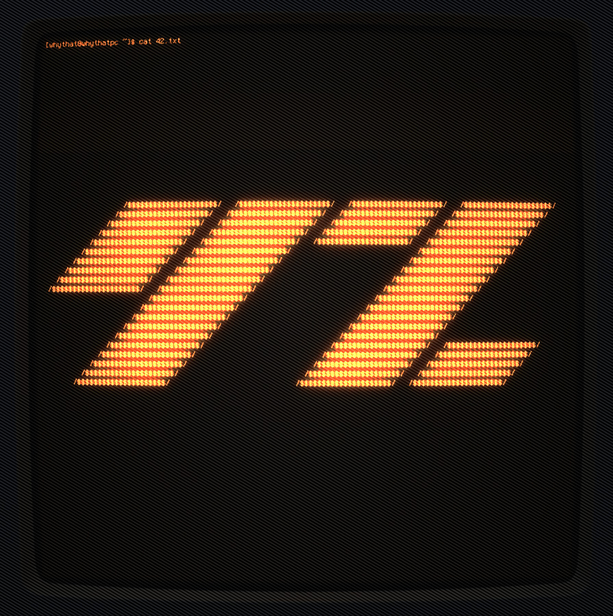
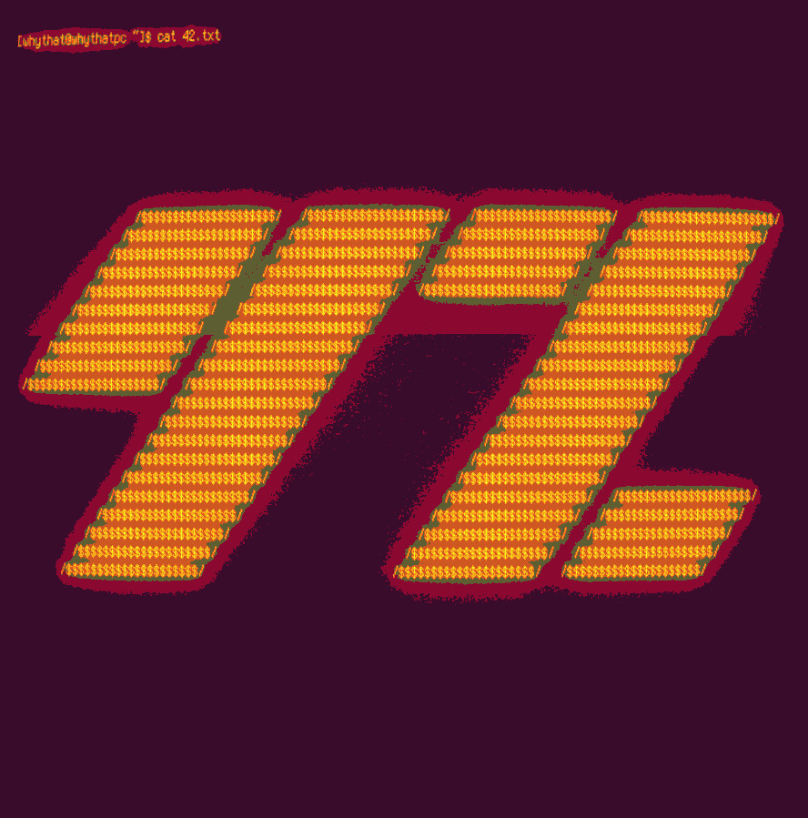

# 42

ASCII-art YZ initials based on the observation that with some fonts, 
YZ can written as 42 using 1337-speak style.

## ASCII
```
                  /$$$$$$$$$$$$$$$$$$$$$/   /$$$$$$$$$$$$$$$$$$$$$/   /$$$$$$$$$$$$$$$$$$$$$/   /$$$$$$$$$$$$$$$$$$$$$/
                /$$$$$$$$$$$$$$$$$$$$$/   /$$$$$$$$$$$$$$$$$$$$$/   /$$$$$$$$$$$$$$$$$$$$$/   /$$$$$$$$$$$$$$$$$$$$$/
              /$$$$$$$$$$$$$$$$$$$$$/   /$$$$$$$$$$$$$$$$$$$$$/   /$$$$$$$$$$$$$$$$$$$$$/   /$$$$$$$$$$$$$$$$$$$$$/
            /$$$$$$$$$$$$$$$$$$$$$/   /$$$$$$$$$$$$$$$$$$$$$/   /$$$$$$$$$$$$$$$$$$$$$/   /$$$$$$$$$$$$$$$$$$$$$/
          /$$$$$$$$$$$$$$$$$$$$$/   /$$$$$$$$$$$$$$$$$$$$$/   /$$$$$$$$$$$$$$$$$$$$$/   /$$$$$$$$$$$$$$$$$$$$$/
        /$$$$$$$$$$$$$$$$$$$$$/   /$$$$$$$$$$$$$$$$$$$$$/                             /$$$$$$$$$$$$$$$$$$$$$/
      /$$$$$$$$$$$$$$$$$$$$$/   /$$$$$$$$$$$$$$$$$$$$$/                             /$$$$$$$$$$$$$$$$$$$$$/
    /$$$$$$$$$$$$$$$$$$$$$/   /$$$$$$$$$$$$$$$$$$$$$/                             /$$$$$$$$$$$$$$$$$$$$$/
  /$$$$$$$$$$$$$$$$$$$$$/   /$$$$$$$$$$$$$$$$$$$$$/                             /$$$$$$$$$$$$$$$$$$$$$/
/$$$$$$$$$$$$$$$$$$$$$/   /$$$$$$$$$$$$$$$$$$$$$/                             /$$$$$$$$$$$$$$$$$$$$$/
                        /$$$$$$$$$$$$$$$$$$$$$/                             /$$$$$$$$$$$$$$$$$$$$$/
                      /$$$$$$$$$$$$$$$$$$$$$/                             /$$$$$$$$$$$$$$$$$$$$$/
                    /$$$$$$$$$$$$$$$$$$$$$/                             /$$$$$$$$$$$$$$$$$$$$$/
                  /$$$$$$$$$$$$$$$$$$$$$/                             /$$$$$$$$$$$$$$$$$$$$$/
                /$$$$$$$$$$$$$$$$$$$$$/                             /$$$$$$$$$$$$$$$$$$$$$/
              /$$$$$$$$$$$$$$$$$$$$$/                             /$$$$$$$$$$$$$$$$$$$$$/   /$$$$$$$$$$$$$$$$$$$$$/
            /$$$$$$$$$$$$$$$$$$$$$/                             /$$$$$$$$$$$$$$$$$$$$$/   /$$$$$$$$$$$$$$$$$$$$$/
          /$$$$$$$$$$$$$$$$$$$$$/                             /$$$$$$$$$$$$$$$$$$$$$/   /$$$$$$$$$$$$$$$$$$$$$/
        /$$$$$$$$$$$$$$$$$$$$$/                             /$$$$$$$$$$$$$$$$$$$$$/   /$$$$$$$$$$$$$$$$$$$$$/
      /$$$$$$$$$$$$$$$$$$$$$/                             /$$$$$$$$$$$$$$$$$$$$$/   /$$$$$$$$$$$$$$$$$$$$$/
```

## Originnal CRT images

Created with `scrot` on [cool-retro-term](https://github.com/Swordfish90/cool-retro-term) 
CRT-styled terminal emulator.









## Effects

Effects were applied by image-distortion resource [*MOSH*](https://getmosh.io/).






