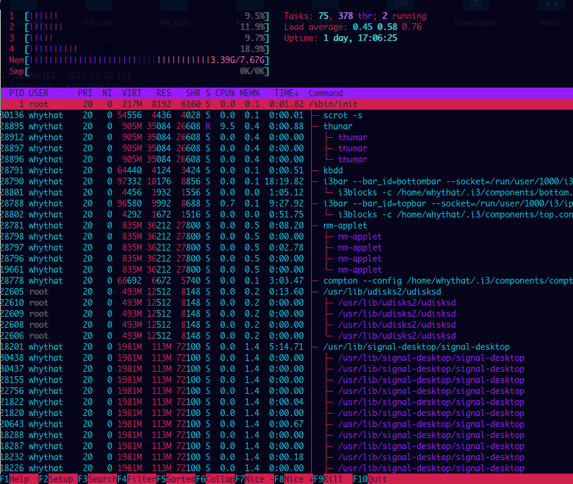
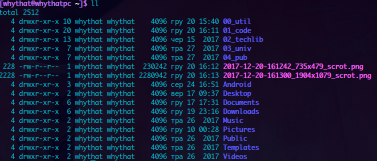
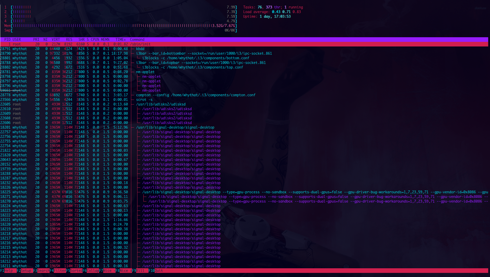

# Bladerunner xfce4-terminal colorscheme

Simple xdce4-terminal colorscheme inspired by Bladerunner 2049 movie
and by MiTo's Lazer keycap set. Parts of the colorscheme were proposed 
on Massdrop discussion page for the keycap set drop.

### Installation 
To be able to load this theme, put the file `bladerunner.theme`
in `~/.local/share/xfce4/terminal/colorschemes/`

